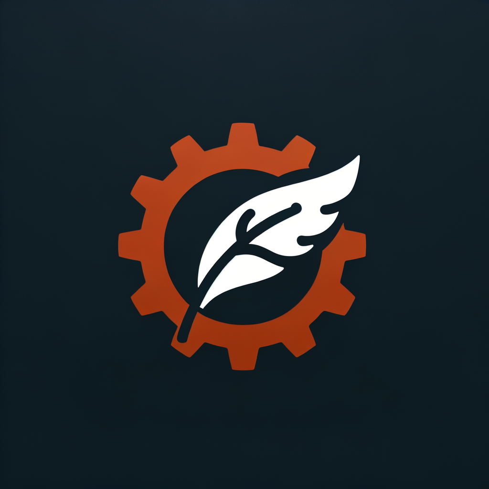

[![Contributors][contributors-shield]][contributors-url]
[![Forks][forks-shield]][forks-url]
[![Stargazers][stars-shield]][stars-url]
[![Issues][issues-shield]][issues-url]
[![MIT License][license-shield]][license-url]


<div align="center">
  <a href="https://github.com/CloverOS/nano-rs">
    
  </a>
</div>

&nbsp;&nbsp;&nbsp;&nbsp;&nbsp;&nbsp;&nbsp;&nbsp;nano-rs是一个轻量级、无入侵且遵循“约定优于配置”原则的Rust Web服务组件，旨在提供一个快速且高效的开发体验。
通过减少配置的负担，让您更能专注于业务逻辑的实现。

---

- **轻量级**: 通过精简的设计，保证自身的启动与运行速度快速且资源占用极低。
- **无入侵**: 框架的设计允许无缝集成到现有的Rust项目中，无需担心对业务代码产生干扰。
- **约定优于配置**: 框架采用“智能默认”的策略，为常见的应用场景提供了预设配置，这意味着您只需少量的配置或不需要任何配置就能开始工作。同时，它也提供充足的配置选项以满足特定需求，确保了极致的灵活性和可扩展性。
- **专注于业务**: 我们的目标是简化Web服务的开发过程，通过减少配置上的繁琐和杂项，让您能够将更多精力集中于业务逻辑的实现，从而提高整个项目开发的效率和质量。

<details>
  <summary>目录</summary>
  <ol>
    <li>
      <a href="#环境要求">环境要求</a>
    </li>
    <li><a href="#安装">安装</a></li>
    <li><a href="#快速开始">快速开始</a> </li>
    <li><a href="#路线图">路线图</a></li>
    <li><a href="#许可">许可</a></li>
    <li><a href="#联系方式">联系方式</a></li>
    <li><a href="#鸣谢">鸣谢</a></li>
  </ol>
</details>

### 环境要求

MSRV >= 1.66

### 安装

```shell
  cargo add nano-rs
```

## 快速开始

Axum

- 添加build依赖

```toml
[build-dependencies]
nano-rs = "0.1.0"
nano-rs-build = "0.1.0"
```

- 添加build.rs

```rust
use std::error::Error;
use nano_rs_build::core::NanoBuilder;
use nano_rs::axum::gen::gen_route::AxumGenRoute;

fn main() -> Result<(), Box<dyn Error>> {
    NanoBuilder::new(None).gen_api_route(AxumGenRoute::new());
    Ok(())
}
```

- 添加配置文件到你想要的目录中(example中放在[etc/config.yaml](https://github.com/CloverOS/nano-rs/blob/master/example/etc/config.yaml))

```yaml
port: 8888
name: example
host: 127.0.0.1
```

- 编写你的api接口(例如在api/pet下) ,关于get宏请参考[example](https://github.com/CloverOS/nano-rs/blob/master/example/src/api)(文档正在路上...)
```rust
#[get(path = "/store/name", layers = ["crate::layers::auth::auth_token1"])]
pub async fn get_store_name() -> Result<RestResp<String>, ServerError> {
    biz_ok("Doggy Store".to_string())
}
```

- 运行一次build(仅项目第一次编译需要)
```shell
cargo build
```

- 添加main.rs(参考example中的项目结构)

```rust
use axum::Router;
use nano_rs::axum::start::run;
use nano_rs::config::init_config_with_cli;
use nano_rs::config::rest::RestConfig;
use crate::routes::get_routes;

mod routes;
mod layers;
mod api;

#[tokio::main]
async fn main() {
    let rest_config = init_config_with_cli::<RestConfig>();
    let _guard = nano_rs::tracing::init_tracing(&rest_config);
    let service_context = ServiceContext {
        rest_config: rest_config.clone(),
    };
    let app = Router::new().nest(
        rest_config.base_path.as_str(),
        get_routes(service_context.clone(), rest_config.clone()),
    );
    run(app, rest_config).await
}

#[derive(Clone)]
pub struct ServiceContext {
    pub rest_config: RestConfig,
}
```
- 运行你的web
```shell
cargo run -- --config etc/config.yaml
```
- 在这之后，您只需要编写您的业务逻辑代码，nano-rs将会自动生成路由并注册到axum，您只需要关注业务逻辑的实现即可。

## 路线图

- [x] Axum框架路由自动生成
- [x] 默认配置Tracing日志框架
- [x] 预置通用web服务配置（通过yaml管理）
- [ ] OpenApi自动生成

有关建议功能（和已知问题）的完整列表，请参阅[未解决的问题](https://github.com/CloverOSe/nano-rs/issues)。


<!-- LICENSE -->

## 许可

根据 MIT 许可证分发。有关更多信息，请参阅“LICENSE.txt”。


<!-- CONTACT -->

## 联系方式

- a527756694@gmail.com

## 鸣谢

* [Anyhow](https://github.com/dtolnay/anyhow)
* [Axum](https://github.com/tokio-rs/axum)
* [Clap](https://github.com/clap-rs/clap)
* [Tokio](https://github.com/tokio-rs/tokio)
* [Tracing](https://github.com/tokio-rs/tracing)

<!-- MARKDOWN LINKS & IMAGES -->
<!-- https://www.markdownguide.org/basic-syntax/#reference-style-links -->

[contributors-shield]: https://img.shields.io/github/contributors/CloverOS/nano-rs.svg?style=for-the-badge

[contributors-url]: https://github.com/CloverOS/nano-rs/graphs/contributors

[forks-shield]: https://img.shields.io/github/forks/CloverOS/nano-rs.svg?style=for-the-badge

[forks-url]: https://github.com/CloverOS/nano-rs/network/members

[stars-shield]: https://img.shields.io/github/stars/CloverOS/nano-rs.svg?style=for-the-badge

[stars-url]: https://github.com/CloverOS/nano-rs/stargazers

[issues-shield]: https://img.shields.io/github/issues/CloverOS/nano-rs.svg?style=for-the-badge

[issues-url]: https://github.com/CloverOS/nano-rs/issues

[license-shield]: https://img.shields.io/github/license/CloverOS/nano-rs.svg?style=for-the-badge

[license-url]: https://github.com/CloverOS/nano-rs/blob/master/LICENSE.txt